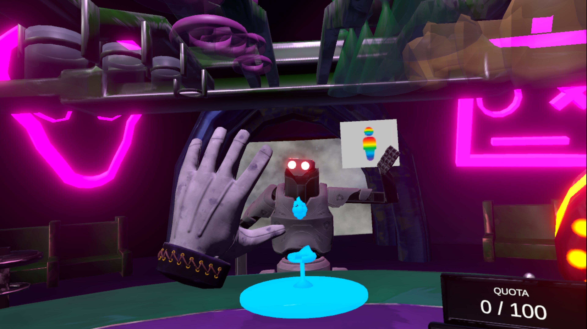
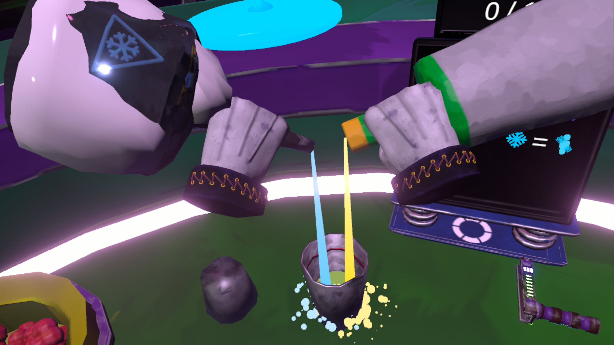
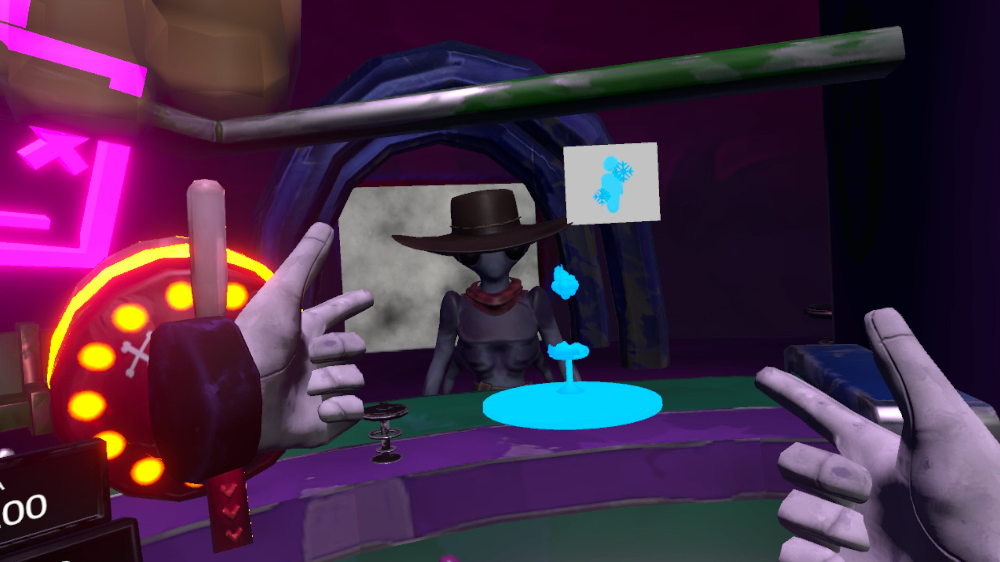
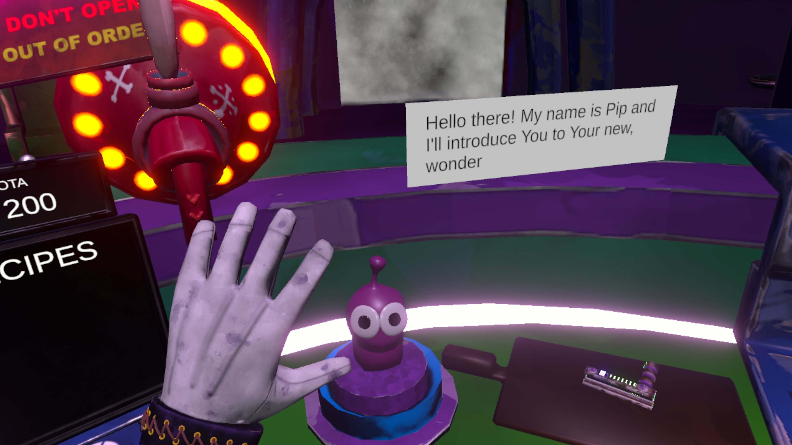

# NebulaNook 🚀
A VR bartending game set in a mysterious interstellar bar. Mix wild drinks, slice alien fruits, and serve thirsty extraterrestrials — but watch out… something strange is going on behind the scenes.

  

**Nebula Nook** is a game made for Meta Quest 3/3S, built in Unity using OpenXR.
## Gameplay 🎮
Step behind the bar and into the chaos! As the newest bartender in Nebula Nook, your job is to mix outrageous cocktails using cosmic liquors, weird fruits, and bizarre ingredients from across the galaxy.
- **Mix and Match**: Combine various alien spirits to create unique drinks.
- **Precision Cutting**: Slice, dice, and garnish with precision for that five-star service.
- **Serve in Style**: Deliver drinks to an ever-changing cast of weird and wonderful space patrons.
- **Wild Reactions**: Each drink triggers unexpected effects — from explosive burps to frozen customers. Adapt quickly or face the consequences!

Time is money — literally. Each shift, you’ll need to hit a drink quota before the end of the shift. Fail, and… well, let’s just say there’s a _reason_ turnover here is high.

    
    

    

## Story 📖
You're the newest hire at _Nebula Nook_, a bar floating in the depths of space. Upon arrival, you're greeted by **Pip**, an overly enthusiastic (and slightly suspicious) little purple alien who shows you the ropes.

The job seems simple — make drinks, earn credits, survive the night. But things aren't quite what they seem. Every previous bartender has mysteriously vanished, and Pip’s nervous laughter doesn’t help.
Why is Pip so insistent on you making your quota every night? What happens if you don’t?

Keep the customers happy. Keep the credits flowing. And whatever you do… don’t ask what happened to the last bartender.

    

### Our Team ⭐️

  <table style="width:100%; text-align:center;">
    <tr>
      <th style="text-align: center">Teammate</th>
      <th style="text-align: center">Role</th>
    </tr>
    <tr>
      <td><a href="https://github.com/bazyl02">Mateusz Podgórski</td>
      <td>Lead Game Programmer</td>
    </tr>
    <tr>
      <td><a href="https://github.com/Gregorooooo02">Grzegorz Bednarek</td>
      <td>Lead Game Designer</td>
    </tr>
    <tr>
      <td><a href="https://github.com/heshsaih">Kamil Maciocha</td>
      <td>Game Programmer</td>
    </tr>
    <tr>
      <td><a href="https://www.artstation.com/user-5119974">Bartosz Żuber</td>
      <td>Lead Environment Artist</td>
    </tr>
    <tr>
      <td><a href="https://www.artstation.com/flyzie?fbclid=IwZXh0bgNhZW0CMTEAAR6ze6CLfcu3O-MXbpOoTLwZb24iWcj7UQL4WpZseIiVYsawcmVJRKgFu4GkEw_aem_QUzM2Rfw4aPSThnrLDfkmg">Bartłomiej Rutowicz</td>
      <td>Lead Character Artist</td>
    </tr>
    <tr>
      <td><a href="https://github.com/TreBroN02">Norbert Rudny</td>
      <td>Lead 3D Animator</td>
    </tr>
  </table>

